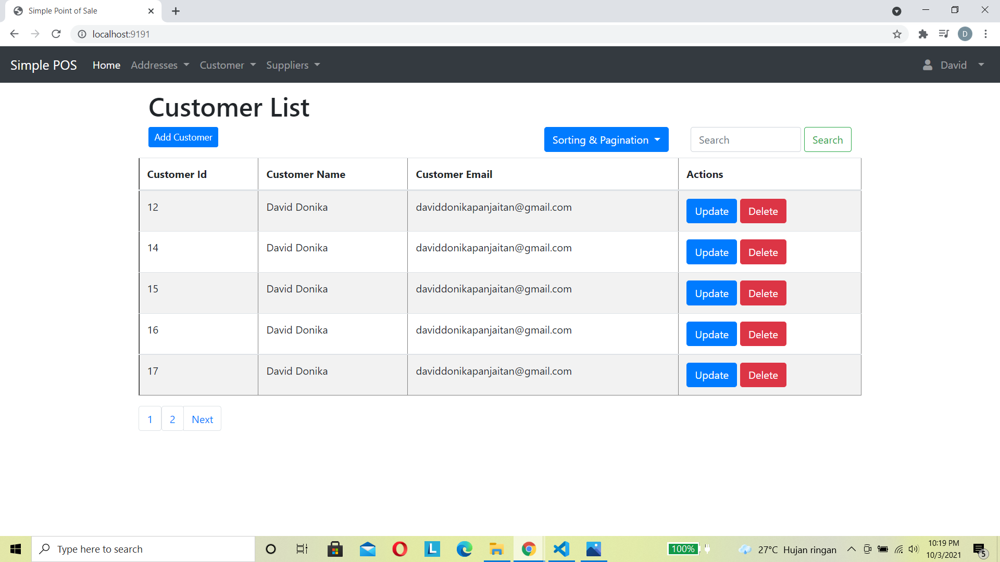

Simple Application Point of Sale

Goals: to make simple point of sale which have feature CRUD per role (Admin, customer, and suppleirs).

Feature:
- Addresses
- Adderss Types
- Basket Items
- Customer Address
- Customer
- Inventory Locations
- Payment Method
- Product
- Product Suppliers
- Product Types
- Profile 
- Shopping Basket
- Supplier Locations
- Suppliers
- Login
- User Registration

Feature Session:
- User Roles
- Templating base roles

Image: 

-   Customer Dashboard

-   ERD Design Database:

-   Customer List CRUD: 

-   Login: 

-   Products: 

-   Registration: 

-   Supplier: 

